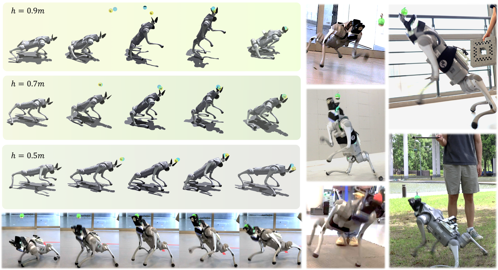

# Playful Doggybot #
<p align="center">
  
</p>

> **Project website**: [Playful-Doggybot-Website](https://playful-doggybot.github.io/) <br>
**Authors**: 
[Xin Duan](https://duanxin926.github.io/)
[Ziwen Zhuang](https://ziwenzhuang.github.io/),
[Sören Schwertfeger](https://robotics.shanghaitech.edu.cn/people/soeren),
[Hang Zhao](https://hangzhaomit.github.io/)<br>
<br>

## Repository Structure ##
* `legged_gym`: contains the isaacgym environment and config files.
    - `legged_gym`:
        - `legged_gym/legged_gym/scripts/`: training and visualization scripts. 
        - `legged_gym/legged_gym/envs/go2/`: training config files.
        - `legged_gym/legged_gym/envs/base/`: environment implementation.
    - `resources`: URDF files and robot models.
    - `logs`: where to store training logs and checkpoints.
* `rsl_rl`: contains the network module and algorithm implementation. You can copy this folder directly to your robot.
    - `rsl_rl/rsl_rl/algorithms/`: algorithm implementation.
    - `rsl_rl/rsl_rl/modules/`: network module implementation.
 

## Installation
1. Clone the repository and create a new Python virtual env or conda environment with Python 3.8(recommended)
    - `conda create -n doggy python=3.8`
2. Install PyTorch 1.10 with cuda-11.3:
    - `pip install torch==1.10.0+cu113 torchvision==0.11.1+cu113 torchaudio==0.10.0+cu113 -f https://download.pytorch.org/whl/cu113/torch_stable.html`
3. Install Isaac Gym
   - Download and install Isaac Gym Preview 4 (I didn't test the history version) from https://developer.nvidia.com/isaac-gym
   - `cd isaacgym/python && pip install -e .`
   - Try running an example `cd examples && python 1080_balls_of_solitude.py`
   - For troubleshooting check docs `isaacgym/docs/index.html`
4. Install rsl_rl (PPO implementation)
   - Using the command to direct to the root path of this repository
   - `cd rsl_rl && pip install -e .` 
5. Install legged_gym
   - `cd ../legged_gym && pip install -e .`


## Usage ##
***Always run your script in the root path of this legged_gym folder (which contains a `setup.py` file and `video.sh` file).***

1. To train a policy
    - `python legged_gym/scripts/train.py --headless --task go2_mix_cmd`
    
2. To visualize a checkpoint
    - `python legged_gym/scripts/play.py --task go2_mix_cmd --load_run <path_to_your_ckpt>`
    - (Optional) Substitute `play.py` with `play_node.py`, which enables you to record all the reward and other kind of information during the visulization as a `.mcap` bag file. We recommand the tool [Foxglove Studio](https://docs.foxglove.dev/docs/introduction/) to replay the bag files for easily debugging and reward engineering.

## Acknowledgement
This project is supported by Shanghai Qi Zhi Institute and ONR grant N00014-20-1-2675 and has been partially funded by the Shanghai Frontiers Science Center of Human-centered Artificial Intelligence. The experiments of this work were supported by the core facility Platform of Computer Science and Communication, SIST, ShanghaiTech University. Thanks to Qi Wu for the detailed technical support. We thank Zipeng Fu, Xuxin Cheng, Wenhao Yu and Erwin Coumans for the feedback and discussion.

## Citation ##
```
@inproceedings{duan2024playful,
  author    = {Duan, Xin and Zhuang, Ziwen and Zhao, Hang and Sören Schwertfeger}
  title     = {Playful DoggyBot: Learning Agile and Precise Quadrupedal Locomotion},
  booktitle = {arXiv},
  year      = {2024},
}
```
